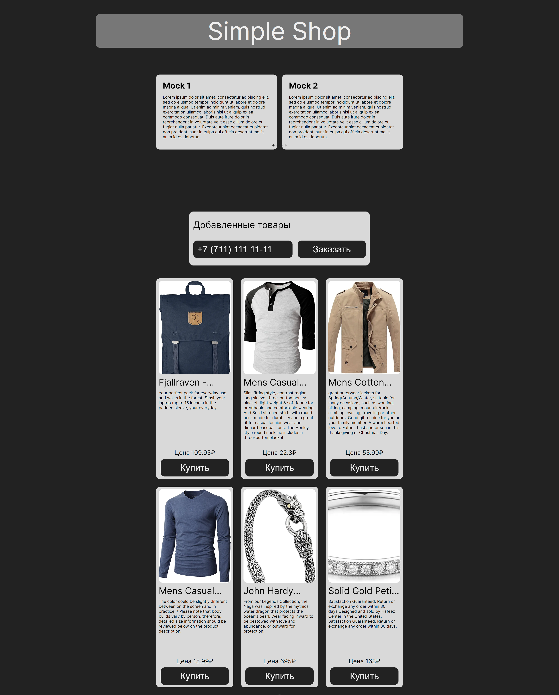

# Simple Shop NextJS

Просто интернет магазин, без использования баз данных, без регистрации, с отправкой заказа на почту

## Основные функции

- **Бесконечный скролл:**
- **Добавление товара в корзину:**
- **Отправка оповещения на почту:**
- **Адаптивность:**

## Ссылки:

### Демо: [=> Link Site <=](https://simple-shop-nextjs-alpha.vercel.app/)

## Frontend:

- ✅ React: ^18
- ✅ React Dom: ^18
- ✅ NextJS: 14.2.0,
- ✅ Typescript: 5.2.2,
- ✅ Zustand: 4.5.2,
- ✅ Sass: 1.75.0,
- ✅ Swiper: 11.1.1,
- ✅ FSD
- ✅ Rest API

## Развёртывание и настройка проекта

- Клонируйте репозиторий через командную строку:

```
git clone https://github.com/vink-bot/frontend
```

- Перейдите в локальную папку с проектом
- Установите зависимости командой:

```
npm i
```

Настройте env переменные, в корневой папке src создайте файл .env и занесите в него данные

```
echo "BACKEND_API_URL='//localhost:3000/api'" > .env
```

.env

```dotenv
BACKEND_API_URL='//localhost:3000/api'
```

- Запустите приложение:

```
npm run dev
```
## Настройка каталога товаров и отзывов

- Каталог товаров лежит в файле `./src/shared/mock/productsMock.ts`
- Список отзывов в файле `./src/shared/mock/reviewsMock.ts`

## Поддержка Браузеров

|                                                               Chrome                                                               |                                                               Firefox                                                                |                                                               Edge                                                                |                                                               Safari                                                                |                                                               Opera                                                                |
|:----------------------------------------------------------------------------------------------------------------------------------:|:------------------------------------------------------------------------------------------------------------------------------------:|:---------------------------------------------------------------------------------------------------------------------------------:|:-----------------------------------------------------------------------------------------------------------------------------------:|:----------------------------------------------------------------------------------------------------------------------------------:|
|  |  |  |  |  |

## Фото чата


